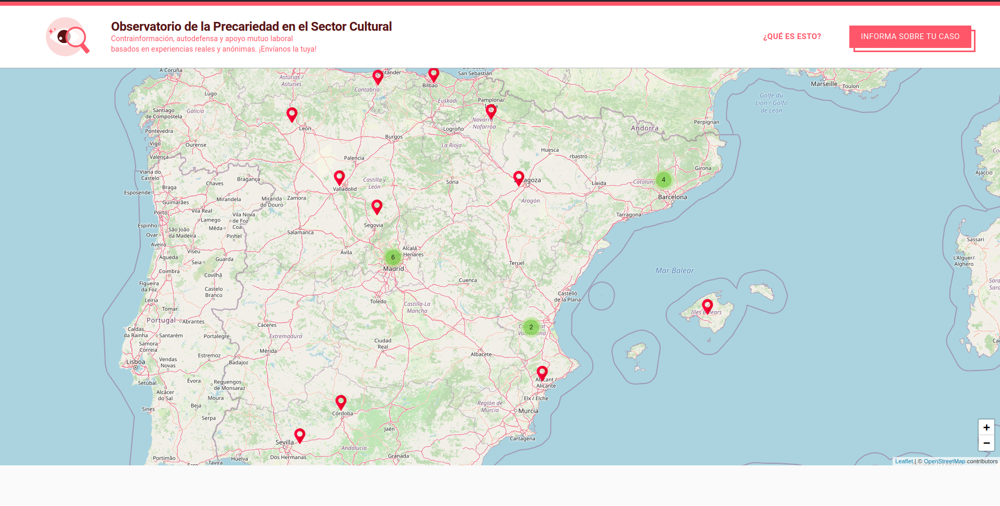
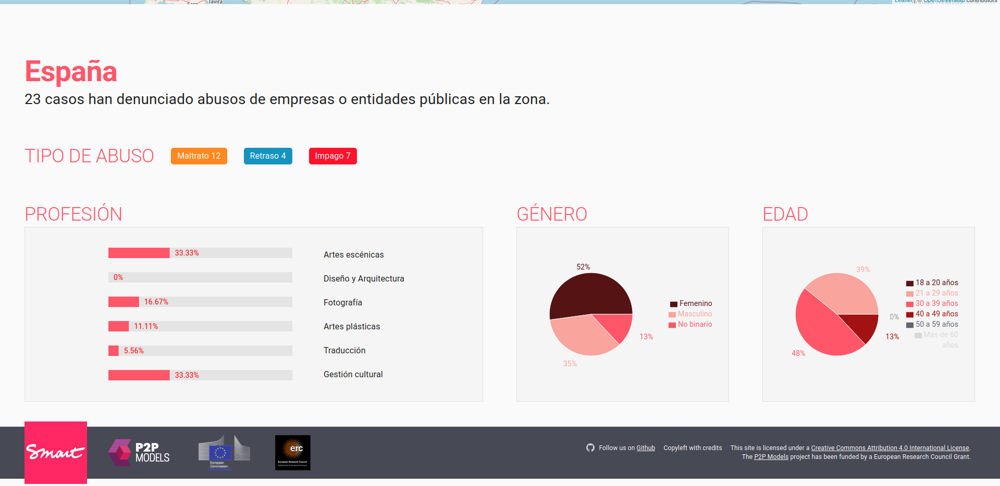
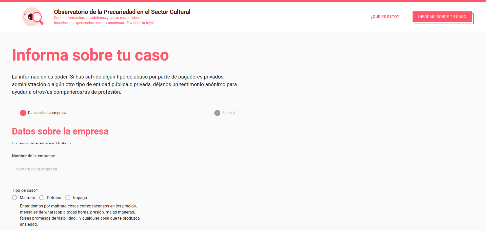
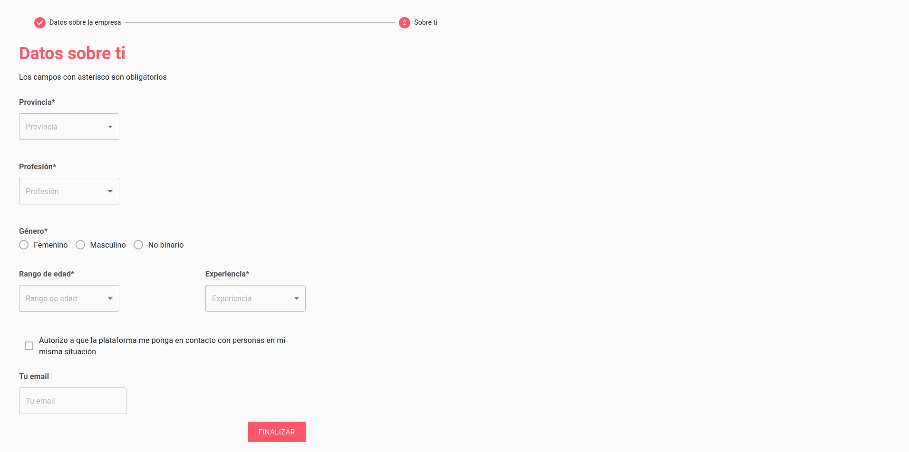

# Wall of Shame

## Introduction

The Observatory of Spanish Artistic Precarity prototype is a dynamic platform that visualizes metric data regarding current worker conditions and provides more visibility to the problem of precarity for cultural workers. At the same time, it allows users to create networks with each other and reach out to help entities after posting their public denouncement. Thanks to blockchain technology, the platform will be transparent and harder to censor (contrary to other projects based on mainstream platforms, e.g.@TrabajosRuineros). By relying on a set of quantitative data provided by users, we should also be able to visualize and address salary gaps depending on gender, location and type of (artistic) profession, which can help further analysis and policy-making around precarity. 

The prototype has three main goals:

- __Monitorization__: provide data to organizations and collectives in order to develop strategies for solving this issue through social means.

- __Visibilization__: raise awareness of job insecurity in Spain to the public.

- __Collectivization__: ease the process of contacting organizations, collectives and individuals with similar issues with the intention of increasing social participation outside the digital sphere.


## Demo & documentation

If you want to test the current version of the prototype check the [live demo](https://observatorio.p2pmodels.eu). The [documentation](https://docs.observatorio.p2pmodels.eu) of the prototype is available.

## Screenshots






## Instalation and Setup

In order to setup and run the front-end run the following commands:

```
$ npm install
$ npm start
```

A new tab in your default browser should open automatically.

If you want to modify and deploy the a diferent smart contract or subgraph visit the [Wall of Shame backend repo](https://github.com/P2PModels/wallofshame-backend)

## Documentation

Read the [docs](https://observatorio.docs.p2pmodels.eu) for more information

## References

-   This project was bootstrapped with [Create React App](https://github.com/facebook/create-react-app)
-   We use [Material-UI](https://material-ui.com/getting-started/installation/) for UI components
-   [Ethers.js v5](https://docs.ethers.io/v5/) for web3 interactions
-   The MetaMask connection is handled by [useMetamask React Hook](https://github.com/mdtanrikulu/use-metamask)
-   [Apollo client](https://www.apollographql.com/docs/react/) to interact with The Graph network and our backend
-   [Dashboard template](https://github.com/mui-org/material-ui/tree/master/docs/src/pages/getting-started/templates/dashboard)
-   [Map charts library](https://www.react-simple-maps.io/)
-   [Form tutorial](https://www.youtube.com/watch?v=-XKaSCU0ZLM)

## Deployment

[](https://github.com/P2PModels/wallofshame-frontend/actions/workflows/deploy-app.yml)