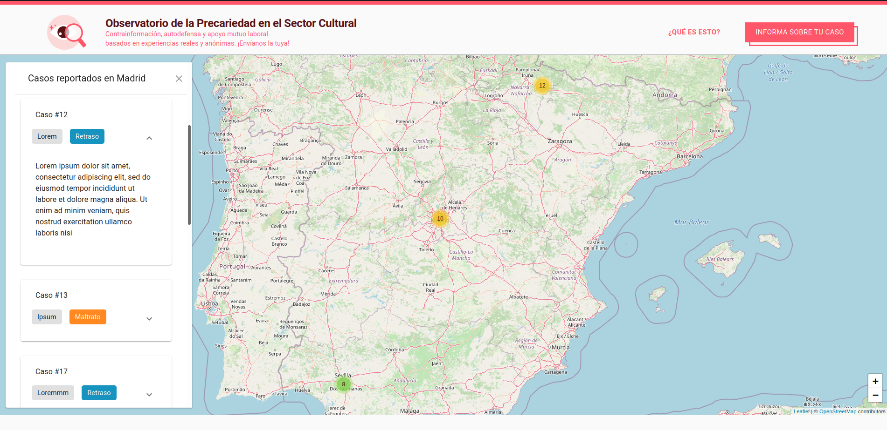
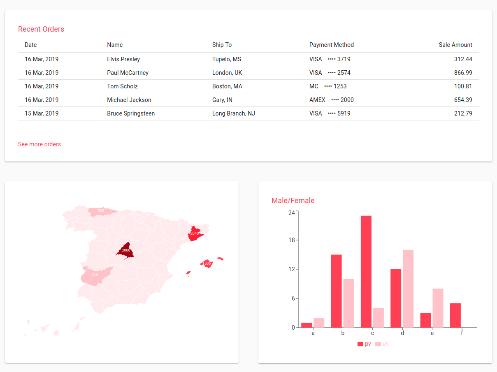
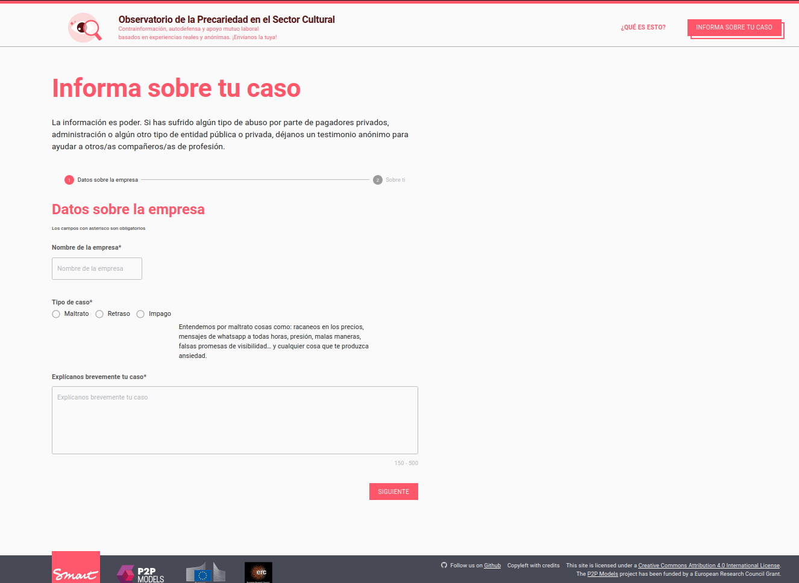
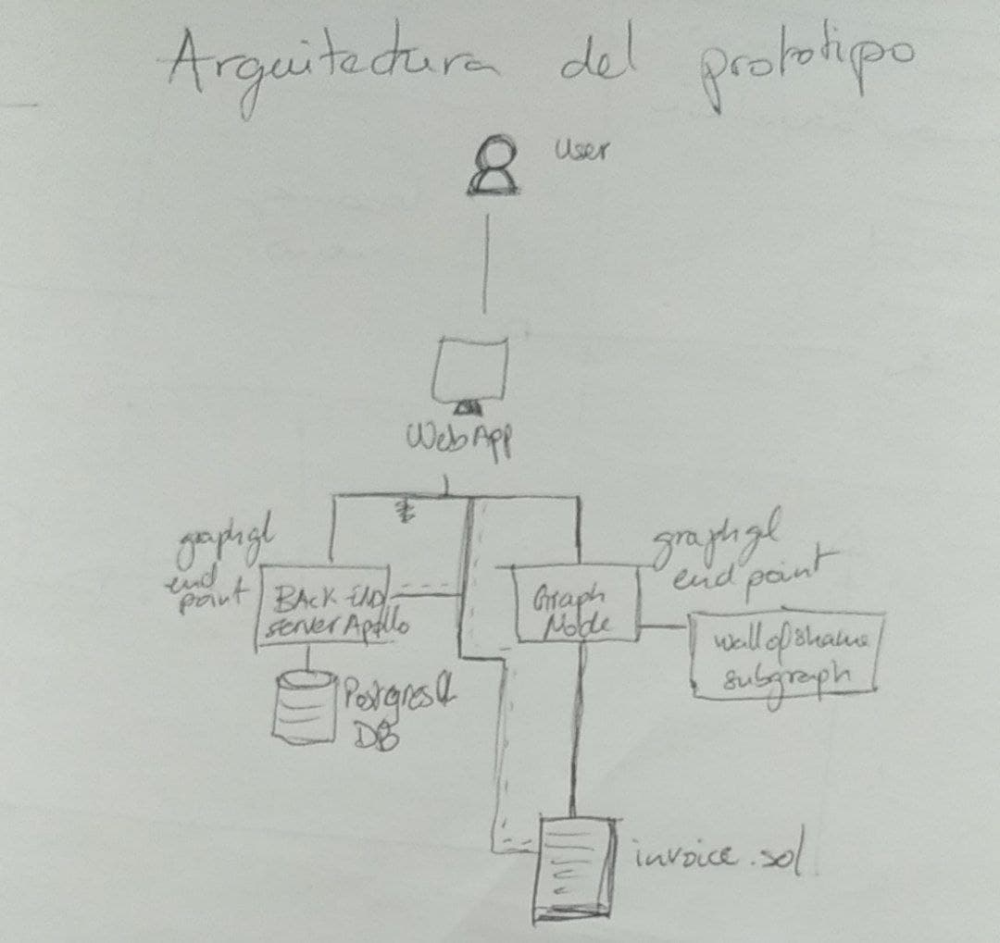

# 🎨✊📊 __Observatory of Spanish Artistic Precarity__ 📊✊🎨
## Introduction

The Observatory of Spanish Artistic Precarity prototype is a dynamic platform that visualizes metric data regarding current worker conditions and provides more visibility to the problem of precarity for cultural workers. At the same time, it allows users to create networks with each other and reach out to help entities after posting their public denouncement. Thanks to blockchain technology, the platform will be transparent and harder to censor (contrary to other projects based on mainstream platforms, e.g.@TrabajosRuineros). By relying on a set of quantitative data provided by users, we should also be able to visualize and address salary gaps depending on gender, location and type of (artistic) profession, which can help further analysis and policy-making around precarity. 

The prototype has three main goals:

- __Monitorization__: provide data to organizations and collectives in order to develop strategies for solving this issue through social means.

- __Visibilization__: raise awareness of job insecurity in Spain to the public.

- __Collectivization__: ease the process of contacting organizations, collectives and individuals with similar issues with the intention of increasing social participation outside the digital sphere.





Some screenshots from the current state of the prototype.

## Instalation and Setup

### Ubuntu 20.04 LTS

In order to setup the whole prototype you need to install the [Wall of Shame backend repo](https://github.com/P2PModels/wallofshame-backend) and the [Wall of Shame backend repo](https://github.com/P2PModels/wallofshame-backend)  the front-end open your command-line and run the following commands:

```
$ git clone https://github.com/p2pmodels/wallofshame-frontend
$ cd wallofshame-frontend
$ npm install
$ npm start
```

A new tab in your default browser should open automatically.

If you want to modify and deploy the a diferent smart contract or subgraph visit the [Wall of Shame backend repo](https://github.com/P2PModels/wallofshame-backend)

## Technology stack

The main frameworks and libraries used in this prototype are:

### Frontend

-   React.js: this project was bootstrapped with [Create React App](https://github.com/facebook/create-react-app).
-   [Material-UI](https://material-ui.com/getting-started/installation/): for UI components.
-   [Ethers.js v5](https://docs.ethers.io/v5/): for web3 interactions.
-   [useDapp](https://usedapp.io): provides useful react hooks for blockchain interactions.
-   [Apollo client](https://www.apollographql.com/docs/react/): to interact with The Graph network and our backend.
-   [GraphQL](https://graphql.org/): as the data transfer layer replacing traditional REST API's.

### Backend

-   [Apollo server](https://www.apollographql.com/docs/apollo-server/)
-   [Prisma](https://www.prisma.io/): node.js ORM to manage your db.
-   [Nexus](https://nexusjs.org/): Declarative, Code-First GraphQL Schemas for JavaScript/TypeScript
-   [GraphQL](https://graphql.org/): as the data transfer layer replacing traditional API's.
-   [PostgresQL](https://www.postgresql.org/): open-source relationtal database.

### Blockchain

-   [Ethereum](https://ethereum.org/en/): blockchain 2.0 network.
-   [Solidity](https://soliditylang.org/): programming language for developing smart contracts in the Ethereum blockchain.
-   [Hardhat](https://hardhat.org/): development tools to develope, test and deploy smart contracts.
-   [Waffle](https://ethereum-waffle.readthedocs.io/en/latest/): testing library for smart contracts.
-   [The Graph](https://thegraph.com/en/): decentralized service for indexing complex events in the blockchain.

### Deployment

The backend of the project has been containerized using [Docker-compose](https://docs.docker.com/compose/).

## Architecrure



At the blockchain level we find the Invoice smart contract, which will serve as the application contract. The task of this contract is to abstract common characteristics of invoices and serve as a registry with permissions, events, status variables, etc.

At the backend level we use an Apollo server with a GraphQL API to make use of a hybrid architecture in which we can implement three different models:

1. Transparent use of blockchain without the option to recover account: The only ethereum account (EOA) would be the one of P2PModels and it will cover the costs for all the blockchain interactions. As mentioned in [Task assignment in Amara. Prototyping Round Robin with blockchain (I)](https://p2pmodels.eu/task-assignment-in-amara-prototype-round-robin/):

    > The idea behind this component is to cover the costs related to these transactions. We want to spare the users (linguists) this expense, as it could severely affect the user experience and usability of the prototype. For the time being, costs will be assumed by a P2P Models Ethereum account, but in the future, an Amara account could be used to handle expenses. Another solution could be a multi-signature account controlled by the linguists themselves.

2. Transparent use of blockchain with the possibility for the user of recovering the EOA and start using the web3 interface.
3. Web3 interface by default: this means the user has to be familiar, or learn it, with the blockchain technology.

In this prototype we are going to test the user experience for each scenario to provide some insights in the usability of web3 services for new users. ~~Therefore, the backend server will be used for handling blockchain logic in scenarios 1 and 2.~~ ¿? We use Prisma as middleware software to add this resolvers that may interact with ethereum and also to automate the database (PostgresQL) management and improve code quality.

At the frontend level we have a react app with an Apollo client that connects both with the backend API and the graph (GraphQL endpoints) and also to ethereum through

## References

-   [Dashboard template](https://github.com/mui-org/material-ui/tree/master/docs/src/pages/getting-started/templates/dashboard)
-   [Map charts library](https://www.react-simple-maps.io/)
-   [Form tutorial](https://www.youtube.com/watch?v=-XKaSCU0ZLM)
